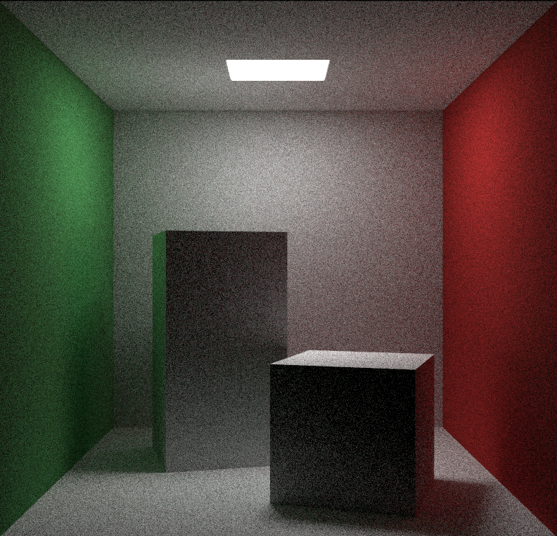
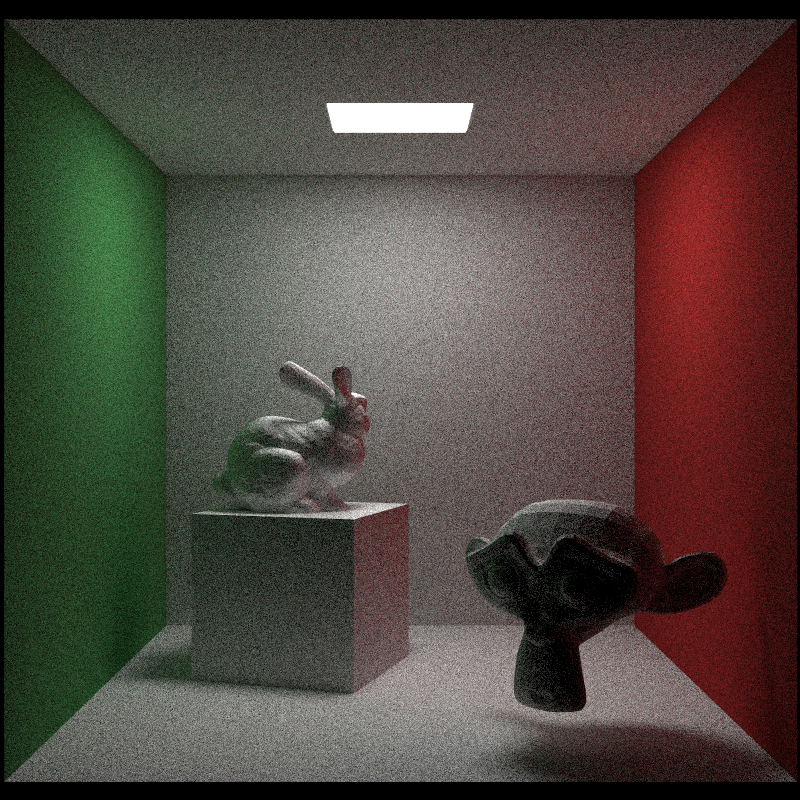

# Y-tracer

A small personal project to learn more about Rust and Ray Tracing. Will little by little improve and add new things on top of what there is already.

Resources that have been used:
- **[Ray Tracing in One Weekend](https://raytracing.github.io/books/RayTracingInOneWeekend.html)**
- **[Ray Tracing The Next Week](https://raytracing.github.io/books/RayTracingTheNextWeek.html)**
- **[Ray Tracing The Rest of Your Life](https://raytracing.github.io/books/RayTracingTheRestOfYourLife.html)**
- Some Rust parallelism ideas and code from **[Fralken](https://github.com/fralken/ray-tracing-the-next-week)**'s work.

Some of the renders as the project progresses:
- Ray Traced Cornell Box



- Ray Traced Cornell Box with Meshes



## Pre-Commit Cleanup

```
cargo clippy --fix --allow-dirty --allow-staged; cargo fmt
```
